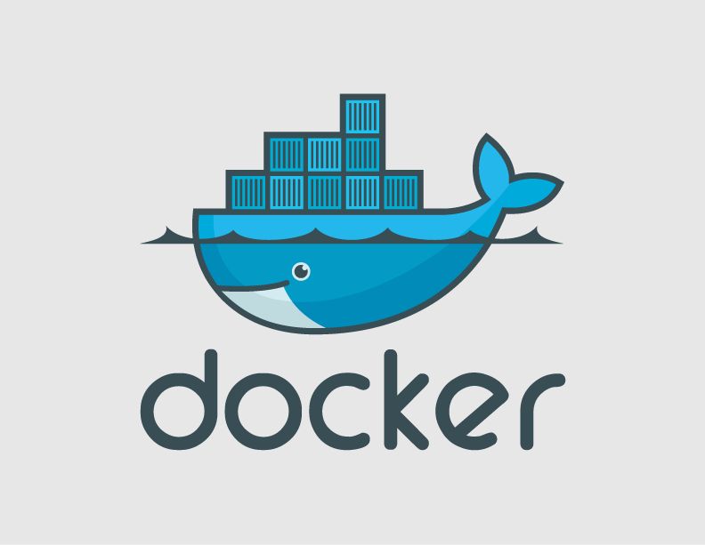
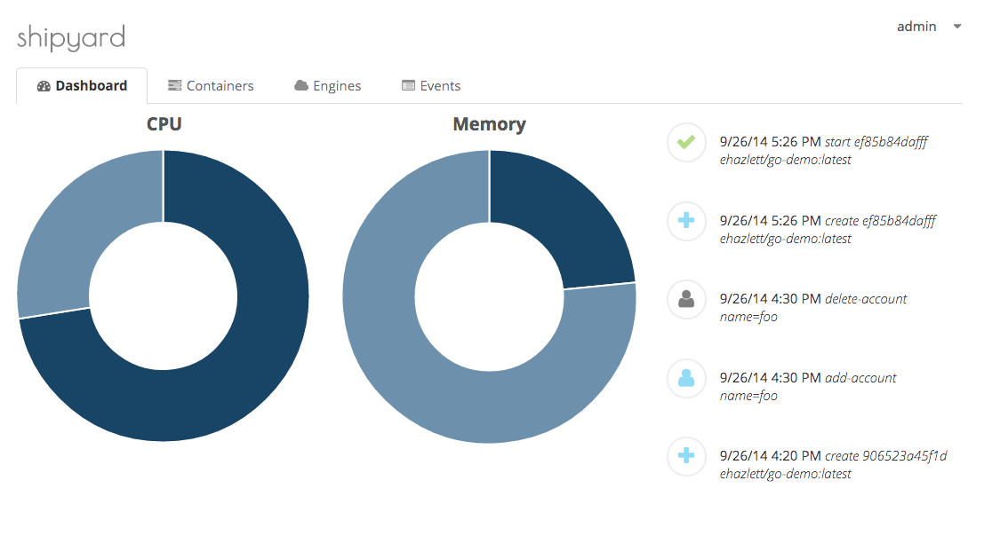
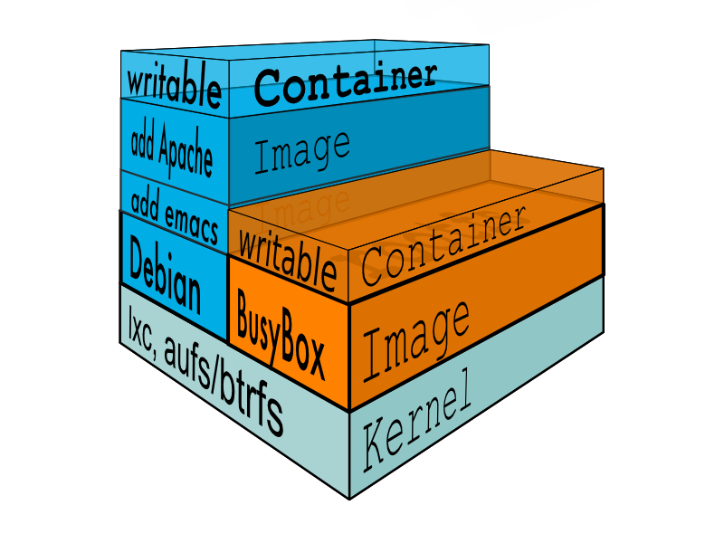
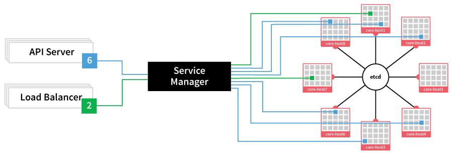
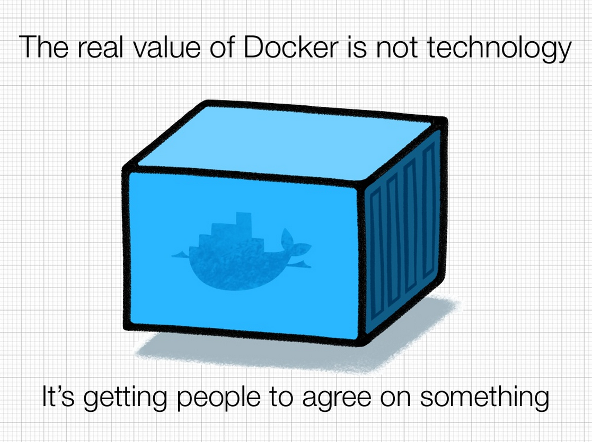

# 

© Christopher Pahl 2014
 
University of Applied Sciences Augsburg

# Welcome!

<b>Poll:</b> Who knows Virtualization/Sandboxing/Docker?

Presentation is less technical than usual.

But it's still technical. Sorry in advance.

Might be a bit linux centered.   

<aside class="notes">
    Presentation is done in jovial tone.
</aside>

# Docker Metadata

* Developed by **dotCloud.com** around 2013
* Written in the Go programming language
* Maintained by **Docker Inc.** now
* Lightweight tool for automated deployment.
* But useful for many other things!

# Terms

## Deployment

``Def:`` The process of distributing software to client machines.

## Sandboxing

``Def:`` Environment for application that provide limited resource access.

<aside class="notes">
    Before we actually start, there are some terms that need clarification.
</aside>

## Virtualization

`Def:` Emulation of hardware through software in order  to run a guest operating system on top of a host system.

# How Deployment was done around 1950

<aside class="notes">
    So, what happens if we're a company that has written some server side software,
    which needs to be installed on the client's hardware? Our software has many 
    dependencies, might rely on certain software versions of, for example, Apache.

    Certain dependencies might still have bugs.
</aside>

Software deployment meant...

...to install the software on the clients hardware.

...to use the software's buildsystem.

...and to install it's dependencies.

...using the dependencie's buildsystems.

...fixing possible bugs on the client's platform.

...fixing possible dependencies bugs. 

...paying treatment cost developer's burnout.

# A bit more recent

Hey, lets use virtualization for testing!

Simulate the clients environment in a virtual machine.

Test it in the VM, just copy the tested software over.

What if the clients environment changes?

# Try again

Hey, just lets ship the Virtual Machine Image!

Works. 

But feels like an awful hack.

Deploying a 5GB+ VM image on every software update.

Seriously?

# Docker to the rescue

* Containers and Images instead of Virtual Machines.
* Deploying the ``diff`` instead of the whole container.
* Base images for many popular linux distributions.
* New base images can be uploaded to [DockerHub](https://hub.docker.com/).
* Docker is the application engine that is able to run containers.
* Usually used completely from the commandline.

<aside class="notes">
    Docker knows Images too, but many containers can be spawned from the same 
    image. A container is just an actively running image with an application
    in it. On updates, only the diff is deployed, which is usually only a few MB large.
</aside>

# Features

* Very fast booting containers (same Kernel!)
* Containerized applications run sandboxed.
* Easy to pack own applications in containers.
* Support for creating own Images.
* Built-in versioning support.
* Divided in Daemon and Docker clients.
- Linking containers together.
* ...

# 

# Technical Stuff

* Focus on processes, not on virtualizing operating systems.
* One process per container.

## Docker builds on Linux features:

* **cgroups:** Grouping processes together.
* **namespaces:** Separate processes in own namespaces.
* **aufs:** Overlay file system.

# 

# Demonstration

## Hello World

<section><pre><code class="bash">
$ docker images
$ docker run base/arch echo "hello augsburg."
</code></pre></section>

<aside class="notes">
    Let's start with Hello world.
    Dockerd already runs.
    Notice how fast the container goes up.
    You always start from a base image, which 
    is usually just a normal stripped down linux distribution.
</aside>

## Entering a container

<section><pre><code class="bash">
$ uname -a
$ docker run -t -i base/arch /bin/bash
> uname -a
> pacman -Syy cowsay
> cowsay "hello augsburg again."
</code></pre></section>

## Versioning & DockerHub

<section><pre><code class="bash">
$ docker ps
$ docker diff 42cb46e2430f
$ docker commit 42cb46e2430f sahib/cowsay_arch
$ docker push sahib/cowsay_arch
</code></pre></section>

Container is now on [DockerHub](https://hub.docker.com/).

# Usecases

* Deployment.
* Sandboxing applications.
* Testbed for application developement.
* Cluster Management with ``CoreOS``.
* ...

<aside class="notes">
    Personal usecase: running a self-written duplicate finder on / 
    System still working? No? Just restart the container.
</aside>

# 

# So, docker is *the new* virtualization? 

Depends on your usecase.

* Still can only run Linux based containers.
* But it can run them on Windows/MacOSX using lightweight virtualization.
  (``boot2docker``).
* Microsoft has plans to port Docker fully to Windows.
* And even to use Windows as Image.
* What about GUI applications?

# 

# Are there areas where virtualization is still needed?

Yes.

<aside class="notes">
    Virtualization is still mightier.
    Docker is just an lightweight alternative in a lot of cases
    VMs are still useful for high availability and reliable
    Also if you need to run whole systems instead of separate applications
</aside>

# References

``Docker on Wikipedia:`` 

[http://en.wikipedia.org/wiki/Docker_(software)]()

``docker.com:``

[https://docker.com]()

``coreos.com:``

[https://coreos.com]()

# Thank you for your attention

(*Hooray, school's out!*)

## Questions?
