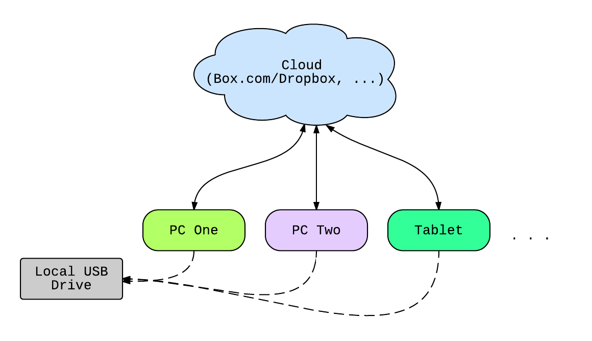
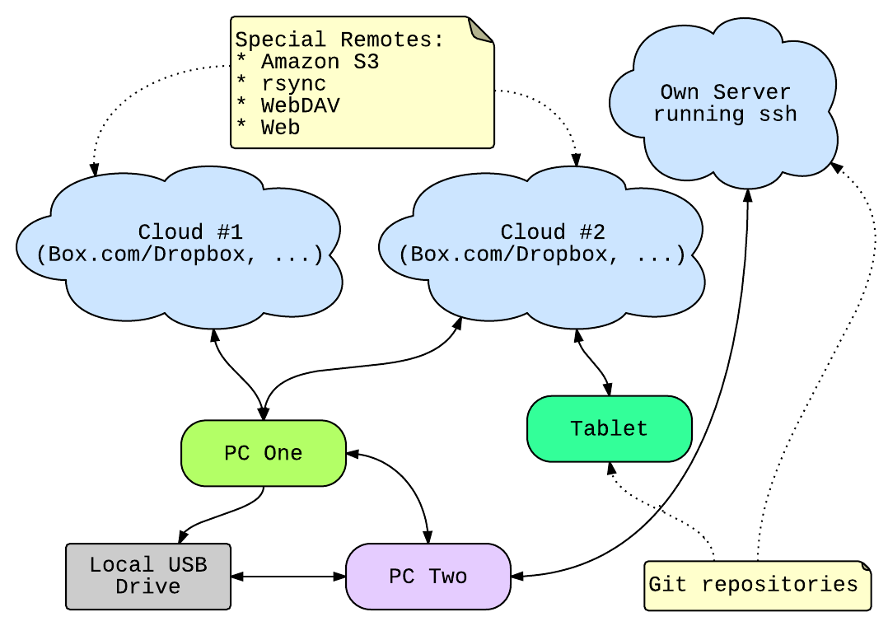

# Distributed filemanagement using git-annex

# Introduction 

This presentation will give you a overview about the concepts and features
provided by the file synchronisation tool git-annex.

# Cloud storage services

Cloud storage is a comfortable solution to share data across several systems and networks

* Today data should be always accessible, on different system
* Using a cloud service like 

    * Box.com
    * Dropbox
    * Megaupload
    * ...

makes sense...but

# There are Issues

* Is your data ,,safe" inside the cloud?
    * [Dropbox issue made password optional](http://techcrunch.com/2011/06/20/dropbox-security-bug-made-passwords-optional-for-four-hours/) for several hours
    * [Data loss](http://www.netzwelt.de/news/149339-dropbox-fehler-loescht-dateien-dokumente-nutzern.html) caused by a bug in Dropbox Client
    * Megaupload taken down by FBI
    * ...

* Local storage
    * Hard drives often silently fail
    * Data gets corrupted by malicious software
    * ...

# A possible Solution

To keep your data safe and secured not just a backup but a backup strategy is
needed.

* Backup important data to different location
* Encrypt sensible data if it is stored in the ,,cloud"
* Track your data, verify your data because hardware is error-prone

Too much effort, right?

# Git - A developers view!

Git is a version control system primary used by developers to track their code
changes. 

* Linus Torvalds calls it: A ,,stupid" content tracker.

* Problem:
    * Not suitable for big binary data

# Git concept - Repositories and Remotes

* A **repository** is the **place where your files are stored.** Usually this are
so-called git remotes. Git remotes have a ``.git`` folder with a specific
structure.

* A **remote** is a **external place where a repository may be stored.** This might be
for example a external usbdrive oder a cloud service

# Git-annex Overview

Git-annex is a tool that extends the git concept by only tracking the content's
metadata. In this way it allows git to track large binary files without
checking them into git.

* Crowdfunding project, reached over $20000
* Developed in Haskell by Joey Hess, a former Debian Developer
* Free Software
* It is a tool primary written by a developer for developers (usually commandline tool)
* But, now there is a fancy GUI which makes git-annex more user friendly

# File synchronisation across different devices and networks

# Git-annex way to synchronize your data

* Git-annex extends git concept by special remotes 

# Shared and hybrid encryption concept

* Supports different encryption use cases

# Other git annex features

* File integrity check by hashing every file with a cryptographic hashsum
* Location tracking of files, git repository stores information about file content and remotes

# Operating System Support

# The git-annex Commandline Usage

~~~
$ git init myrepo
Initialized empty Git repository in /home/qitta/myrepo/.git/
$ cd myrepo
$ git annex init 'myrepo'
init myrepo ok
(Recording state in git...)
~~~

* ``git-annex`` commands to work with:
    * add <filename>
    * drop <filename>
    * whereis <filename>
    * info <filename>

* Just type ``git-annex`` to get the whole list or check the manpage. Usual
``git`` commands are used to add/remove remotes, check status or commit changes.
* Git annex assistant to automate everything needed to synchronize files.

# Git-annex Webapp GUI-Interface

* ,,Like DropBox, but with your own cloud"

# Everything perfect? - Let's sum up

**Pros:**

* Encryption to secure your data
* File integrity and location tracking
* Operating system support
* Free Software
* Integrates itself into existing cloud environment

**Cons:**

* Git annex is still under heavy development
* Commandline Interface is a high entry barrier

# References

`Main ressource:`

[https://git-annex.branchable.com/](https://git-annex.branchable.com/)

`The basics, git annex walkthrough:`

[https://git-annex.branchable.com/walkthrough/](https://git-annex.branchable.com/walkthrough/)

`Some git-annex video tutorials` 

[https://git-annex.branchable.com/videos/](https://git-annex.branchable.com/videos/)

**Thank you for your attention!**

